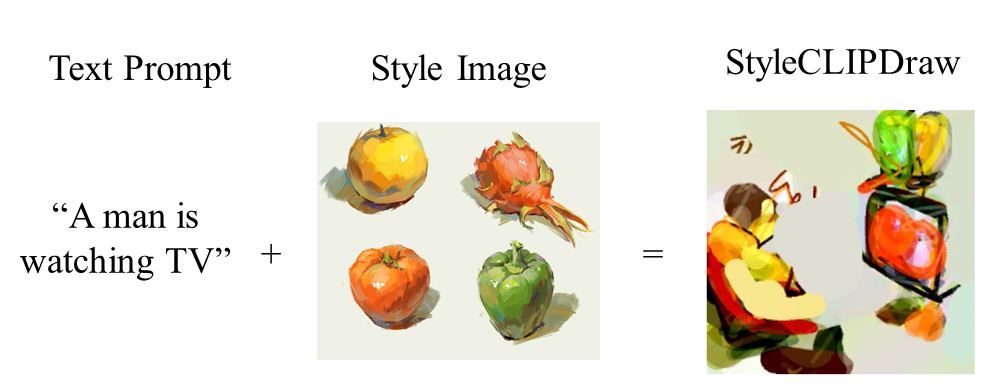
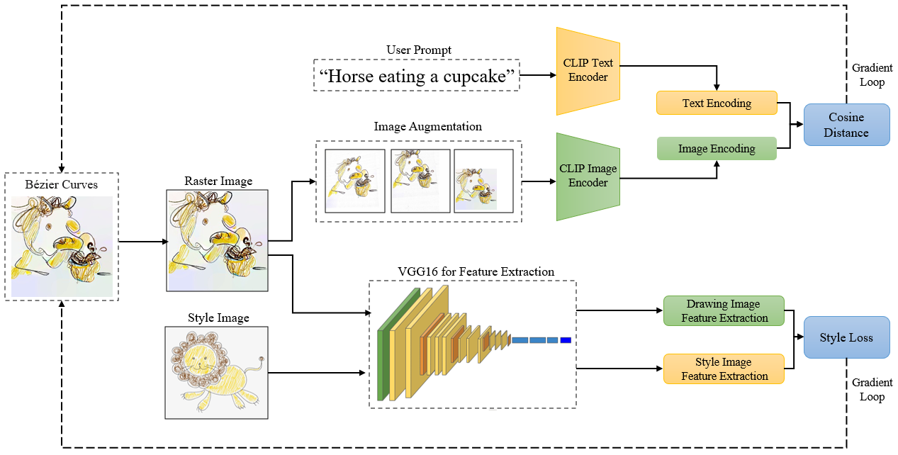
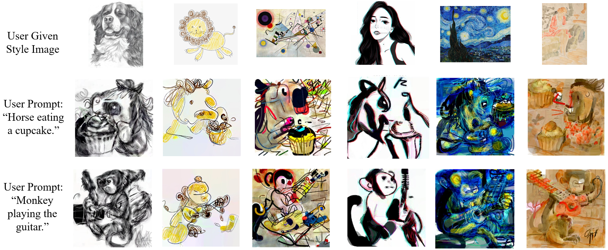
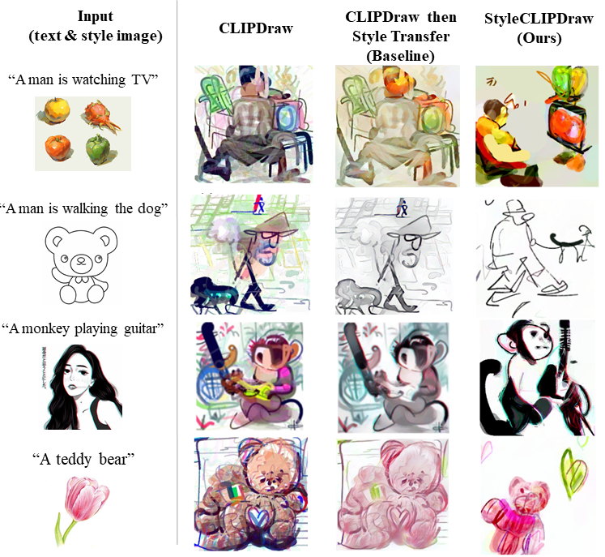

# StyleCLIPDraw
#### Peter Schaldenbrand, Zhixuan Liu, Jean Oh September 2021

Featured at IJCAI'22 and in the 2021 NeurIPS Workshop on Machine Learning and Design [Presentation](https://slideslive.com/38970834/styleclipdraw-coupling-content-and-style-in-texttodrawing-synthesis?ref=account-folder-92044-folders). 
[ArXiv pre-print](https://arxiv.org/abs/2202.12362).

[**Code-free demo on Replicate!!**](https://replicate.com/pschaldenbrand/style-clip-draw)

StyleCLIPDraw adds a style loss to the [CLIPDraw (Frans et al. 2021)](https://arxiv.org/pdf/2106.14843.pdf) [(code)](https://github.com/kvfrans/clipdraw) text-to-drawing synthesis model to allow artistic control of the synthesized drawings in addition to control of the content via text.  Whereas performing decoupled style transfer on a generated image only affects the texture, our proposed coupled approach is able to capture  a  style in both texture and shape, suggesting that the style of the drawing is coupled with the drawing process itself.

Our [Colab demo](https://colab.research.google.com/github/pschaldenbrand/StyleCLIPDraw/blob/master/Style_ClipDraw.ipynb) is currently not working because Colab has removed support for Tensorflow 1.x so the DiffVG dependency will not install. Please use our [Replicate demo](https://replicate.com/pschaldenbrand/style-clip-draw) if you're interested in trying StyleCLIPDraw or install it locally.

    

## Method

<!-- 

    

 -->

    

Unlike most other image generation models, CLIPDraw produces drawings consisting of a series of Bezier curves defined by a list of coordinates, a color, and an opacity.  The drawing begins as randomized Bezier curves on a canvas and is optimized to fit the given style and text. The StyleCLIPDraw model architecture is shown above.  The brush strokes are rendered into a raster image via  differentiable model.  There are two losses for StyleCLIPDraw that correspond to each input.  The text input and the augmented raster drawing are fed the the CLIP model and the difference in embeddings are compared using cosine distance to compute a loss that encourages the drawing to fit the text input.  The image is augmented to avoid finding shallow solutions to optimizing through the CLIP model.  The raster image and the style image are fed through early layers of the VGG-16  model and the difference in extracted features form the loss that encourages the drawings to fit the style of the style image.

## Results

    

## StyleCLIPDraw vs. CLIPDraw then Style Transfer

    

